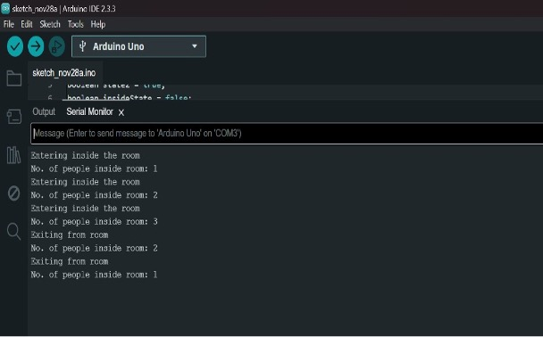

## Bidirectional Visitor Counter using Arduino UNO and IR Sensor

##  Introduction  
The aim of this project is to develop a circuit that can count the number of people entering and exiting a room using two **Infrared (IR) sensors** connected to an **Arduino UNO**. This bidirectional counter helps in determining the number of people currently present in the room.

### How It Works
- When someone passes through the sensors, the sequence of IR interruptions determines entry or exit.
- The **Arduino UNO** processes this data and updates the count accordingly.

## Components Used
- Arduino UNO  
- 2 × IR Sensors  
- Breadboard  
- USB Cable  
- Jumper Wires  

## Working Principle

###  Arduino UNO  
A microcontroller board with 14 digital I/O pins and 6 analog input pins. It is programmable via the Arduino IDE.

> *Figure 1: Arduino UNO*

###  IR Sensors  
Each IR sensor has a transmitter (IR LED) and a receiver (Photodiode). When an object blocks the IR rays, the Arduino detects a voltage change and processes it as an event.

> *Figure 2: IR Sensors*

---

## 🔌 Circuit Connections

- **VCC** of both IR sensors → **5V** pin of Arduino  
- **GND** of both IR sensors → **GND** pin of Arduino  
- **DATA** pins → **Digital Pin 7** and **Pin 8** of Arduino UNO  

> *Figure 3: Circuit Diagram*

---
# Output 

